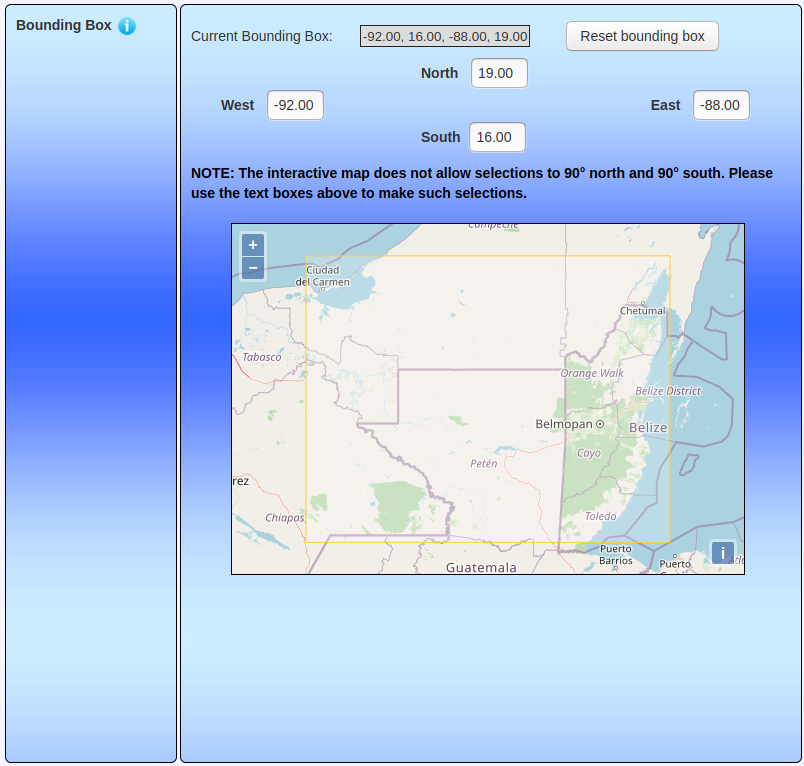

# Objective
Compare the Cariaco SST record we analyzed to Climate Research Unit (CRU) temperature data for the instrumental period covered by both data sets.

# Get CRU Data
The CRU provides access to a global gridded temperature record. These records can be accessed (after registration) at . For more information about the data, see [Harris, I., Osborn, T.J., Jones, P. et al. Version 4 of the CRU TS monthly high-resolution gridded multivariate climate dataset. Sci Data 7, 109 (2020). https://doi.org/10.1038/s41597-020-0453-3](https://www.nature.com/articles/s41597-020-0453-3).

The Center for Environmental Data Analysis (CEDA) hosts an online data repository and search service that we used to extract the CRU temperature data for the Maya region. The [subsetting tool](http://wps-web1.ceda.ac.uk/submit/form?proc_id=Subsetter) is particular useful since it can be used to select a region and time period subset from the total CRU gridded dataset (see figure below).



We selected an area roughly covering the Classic Maya region and downloaded the corresponding monthly gridded temperature data. These data are provided in multiple formats. We selected .csv format (See the ../Data folder of this archive).

Once obtained, we loaded the .csv data into an R dataframe:

```{r}
d <- dir("../Data/CRU/")
d <- d[grep("tmp",d)]
cru <- data.frame()
for(j in d){
    f <- paste("../Data/CRU/",j,sep="")
    cru_tmp <- read.csv(f,head=F,skip=44)
    cru <- rbind(cru,cru_tmp)
}
head(cru)
```

A bit of cleaning is required to remove non-data:

```{r}
cru <- as.matrix(cru[,-1])
cru <- cru[apply(cru,1,function(x)all(!is.na(x))),]
head(cru)
```

Next, we spatially averaged the CRU temperature data for the region and created two temperature time series spanning the overlap between the CRU data and the Cariaco SST reconstruction (i.e, 1901--2008). For one time series, we averaged the monthly data to produce an annual average temperature record. For the other, we included only the months corresponding to the summer SST record, namely June, July, and August, which produced an annual summer average record.

To create the time-series, we first need to generate spatial averages. The rows in the cru matrix each correspond to a latitude in the gridded dataset while the columns correspond to longitudes. There are 6 x 8 of these grid squares in our selected study area. Since the raw data are monthly temperatures, there are 12 of these 6-row chunks per year. Each chunk needs to be averaged to produce the spatial average. So, we will walk over the cru matrix in groups of 6 rows and calculate the average of all grid-cell values in that chunk (i.e., an average of all the values in each 6 x 8 grid):

```{r}
month_chunks <- seq(1,dim(cru)[1],6)
monthly_means <- c()
for(j in month_chunks){
    m_tmp <- mean(cru[j:(j+5),])
    monthly_means <- c(monthly_means,m_tmp)
}
```

With a vector of monthly spatial means, we can now produce both time-series. First we produce the annual series by simply averaging every 12 elements in the `monthly_means` vector and then only the rows corresponding to June, July, and August. The data we downloaded actually corresponds to the latest CRU data and so spans 1901--2020 CE. So, we can also remove the elements corresponding to recent years not covered by the Cariaco SST reconstruction.

```{r}
monthly_mean_matrix <- matrix(monthly_means,nrow=12)
annual_means <- colMeans(monthly_mean_matrix)[1:108]
summer_means <- colMeans(monthly_mean_matrix[c(6,7,8),])[1:108]
```

# Compare the records

We then compared these two time-series to the Cariaco summer SST record (``SSTRub``) with a simple linear regression.

First, we need to load the Cariaco SST record:

```{r}
sst <- read.csv("../Data/wurtzel2013_CariacoSST.csv")
sst_1901_2008 <- subset(sst,YearCE >= 1901 & YearCE <= 2008)
```

Then, we can aggregate all three time-series into a dataframe:

```{r}
tempdata <- data.frame(
                Year=1901:2008,
                CariacoSST=sst_1901_2008$SSTRub,
                CRU_Annual=annual_means,
                CRU_Summer=summer_means)
```

With this dataframe, we can now run a couple of simple linear regressions and store the results for further analysis and plotting:

```{r}
glm_annual <- glm(CRU_Annual~CariacoSST,data=tempdata)
glm_summer <- glm(CRU_Summer~CariacoSST,data=tempdata)
```

To plot the model results, we used `ggplot2`.

```{r}
library(ggplot2)
library(ggpubr)

pred_annual <- predict(glm_annual, se.fit=T)
pred_summer <- predict(glm_summer, se.fit=T)

pred_annual_df <- data.frame(
                    CariacoSST=tempdata$CariacoSST,
                    GLMFit=pred_annual$fit,
                    GLMSE=pred_annual$se.fit)

pred_summer_df <- data.frame(
                    CariacoSST=tempdata$CariacoSST,
                    GLMFit=pred_summer$fit,
                    GLMSE=pred_summer$se.fit)
```

## Time Series
As always, it's useful to look at the raw data, which in this case are the three temperature time series:

```{r fig.cap="Temperature Time Series"}
ggplot(tempdata) +
    geom_path(mapping=aes(y=CRU_Annual,x=Year),colour="#ffbe0f") +
    geom_text(
            x=2000,
            y=mean(tempdata$CRU_Annual),
            colour="#ffbe0f",
            label="CRU Annual") +
    geom_path(mapping=aes(y=CRU_Summer,x=Year),colour="#bd2000") +
    geom_text(
            x=2000,
            y=mean(tempdata$CRU_Summer),
            colour="#bd2000",
            label="CRU Summer") +
    geom_path(mapping=aes(y=CariacoSST,x=Year),colour="#8c0000") +
    geom_text(
            x=2000,
            y=mean(tempdata$CariacoSST),
            colour="#8c0000",
            label="Cariaco SST") +
    labs(y="Temperature (C)", x="Time (CE)") +
    theme_minimal() +
    theme(text = element_text(family="Times", size=12))
```

## Bivariate Plots and GLM Results
Then, we can look at each of the two CRU temperature series compared to the Cariaco reconstruction with the glm results plotted over top:

```{r}
p1 <- ggplot(tempdata) +
    geom_point(mapping=aes(y=CRU_Annual,x=CariacoSST),
        alpha=0.5) +
    geom_path(
        data=pred_annual_df,
        mapping=aes(y=GLMFit,x=CariacoSST),
        alpha=0.8
        ) +
    geom_ribbon(
        data=pred_annual_df,
        mapping=aes(x=CariacoSST,ymin=GLMFit - GLMSE*2.96,ymax=GLMFit + GLMSE*2.96),
        fill="steelblue",
        alpha=0.5
        ) +
    labs(y="Maya Region T (Annual)", x="Cariaco T") +
    theme_minimal() +
    theme(text = element_text(family="Times", size=12),
        axis.title.x=element_blank(),
        axis.text.x=element_blank(),
        axis.ticks.x=element_blank())

p2 <- ggplot(tempdata) +
    geom_point(mapping=aes(y=CRU_Summer,x=CariacoSST),
        alpha=0.5) +
    geom_path(
        data=pred_summer_df,
        mapping=aes(y=GLMFit,x=CariacoSST),
        alpha=0.8
        ) +
    geom_ribbon(
        data=pred_summer_df,
        mapping=aes(x=CariacoSST,ymin=GLMFit - GLMSE*2.96,ymax=GLMFit + GLMSE*2.96),
        fill="steelblue",
        alpha=0.5
        ) +
    labs(y="Maya Region T (Summer)", x="Cariaco T") +
    theme_minimal() +
    theme(text = element_text(family="Times", size=12))

ggarrange(p1,p2,
    ncol=1,
    nrow=2,
    align="v")
```

## Effects
We can also display the regression results numerically:

```{r}
summary(glm_annual)
summary(glm_summer)
```
