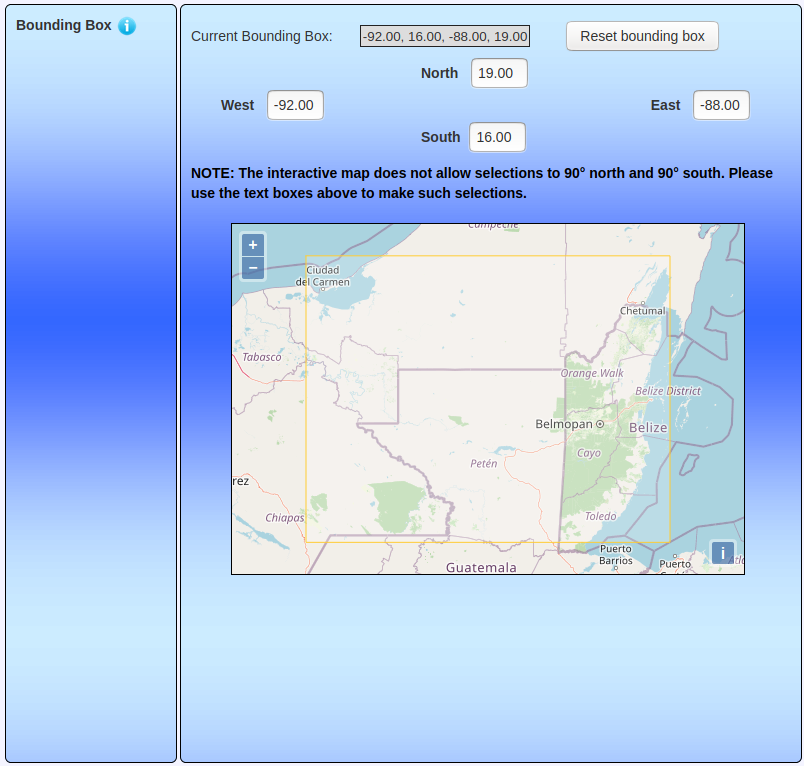

Objective
=========

Compare the Cariaco SST record we analyzed to Climate Research Unit
(CRU) temperature data for the instrumental period covered by both data
sets.

Get CRU Data
============

The CRU provides access to a global gridded temperature record. These
records can be accessed (after registration) at . For more information
about the data, see [Harris, I., Osborn, T.J., Jones, P. et al. Version
4 of the CRU TS monthly high-resolution gridded multivariate climate
dataset. Sci Data 7, 109 (2020).
https://doi.org/10.1038/s41597-020-0453-3](https://www.nature.com/articles/s41597-020-0453-3).

The Center for Environmental Data Analysis (CEDA) hosts an online data
repository and search service that we used to extract the CRU
temperature data for the Maya region. The [subsetting
tool](http://wps-web1.ceda.ac.uk/submit/form?proc_id=Subsetter) is
particular useful since it can be used to select a region and time
period subset from the total CRU gridded dataset.

We selected an area roughly covering the Classic Maya region and
downloaded the corresponding monthly gridded temperature data. These
data are provided in multiple formats. We selected .csv format (See the
../Data folder of this archive).

Once obtained, we loaded the .csv data into an R dataframe:

    d <- dir("../Data/CRU/")
    d <- d[grep("tmp",d)]
    cru <- data.frame()
    for(j in d){
        f <- paste("../Data/CRU/",j,sep="")
        cru_tmp <- read.csv(f,head=F,skip=44)
        cru <- rbind(cru,cru_tmp)
    }
    head(cru)

    ##             V1    V2   V3   V4   V5   V6   V7   V8   V9
    ## 1 Data section 380.0   NA   NA   NA   NA   NA   NA   NA
    ## 2 Data section  17.4 21.7 23.1 23.5 22.3 21.1 22.6 24.2
    ## 3 Data section  20.1 21.0 22.7 23.2 22.1 20.7 19.9 22.9
    ## 4 Data section  21.6 22.3 22.9 22.9 22.0 21.9 22.0 22.8
    ## 5 Data section  23.3 22.9 22.6 22.4 21.8 22.0 22.6 23.1
    ## 6 Data section  23.2 23.0 22.5 22.2 21.6 21.4 22.3 23.0

A bit of cleaning is required to remove non-data:

    cru <- as.matrix(cru[,-1])
    cru <- cru[apply(cru,1,function(x)all(!is.na(x))),]
    head(cru)

    ##        V2   V3   V4   V5   V6   V7   V8   V9
    ## [1,] 17.4 21.7 23.1 23.5 22.3 21.1 22.6 24.2
    ## [2,] 20.1 21.0 22.7 23.2 22.1 20.7 19.9 22.9
    ## [3,] 21.6 22.3 22.9 22.9 22.0 21.9 22.0 22.8
    ## [4,] 23.3 22.9 22.6 22.4 21.8 22.0 22.6 23.1
    ## [5,] 23.2 23.0 22.5 22.2 21.6 21.4 22.3 23.0
    ## [6,] 23.3 23.1 22.5 22.1 21.5 21.5 22.1 22.7

Next, we spatially averaged the CRU temperature data for the region and
created two temperature time series spanning the overlap between the CRU
data and the Cariaco SST reconstruction (i.e, 1901--2008). For one time
series, we averaged the monthly data to produce an annual average
temperature record. For the other, we included only the months
corresponding to the summer SST record, namely March, April, and May,
which produced an annual summer average record.

To create the time-series, we first need to generate spatial averages.
The rows in the cru matrix each correspond to a latitude in the gridded
dataset while the columns correspond to longitudes. There are 6 x 8 of
these grid squares in our selected study area. Since the raw data are
monthly temperatures, there are 12 of these 6-row chunks per year. Each
chunk needs to be averaged to produce the spatial average. So, we will
walk over the cru matrix in groups of 6 rows and calculate the average
of all grid-cell values in that chunk (i.e., an average of all the
values in each 6 x 8 grid):

    month_chunks <- seq(1,dim(cru)[1],6)
    monthly_means <- c()
    for(j in month_chunks){
        m_tmp <- mean(cru[j:(j+5),])
        monthly_means <- c(monthly_means,m_tmp)
    }

With a vector of monthly spatial means, we can now produce both
time-series. First we produce the annual series by simply averaging
every 12 elements in the `monthly_means` vector and then only the rows
corresponding to June, July, and August. The data we downloaded actually
corresponds to the latest CRU data and so spans 1901--2020 CE. So, we
can also remove the elements corresponding to recent years not covered
by the Cariaco SST reconstruction.

    monthly_mean_matrix <- matrix(monthly_means,nrow=12)
    annual_means <- colMeans(monthly_mean_matrix)[1:108]
    summer_means <- colMeans(monthly_mean_matrix[c(6,7,8),])[1:108]

We then compared these two time-series to the Cariaco summer SST record
(`SSTRub`) with a simple linear regression.

First, we need to load the Cariaco SST record:

    sst <- read.csv("../Data/wurtzel2013_CariacoSST.csv")
    sst_1901_2008 <- subset(sst,YearCE >= 1901 & YearCE <= 2008)

Then, we can aggregate all three time-series into a dataframe:

    tempdata <- data.frame(
                    Year=1901:2008,
                    CariacoSST=sst_1901_2008$SSTRub,
                    CRU_Annual=annual_means,
                    CRU_Summer=summer_means)

With this dataframe, we can now run a couple of simple linear
regressions and store the results for further analysis and plotting:

    glm_annual <- glm(CRU_Annual~CariacoSST,data=tempdata)
    glm_summer <- glm(CRU_Summer~CariacoSST,data=tempdata)
